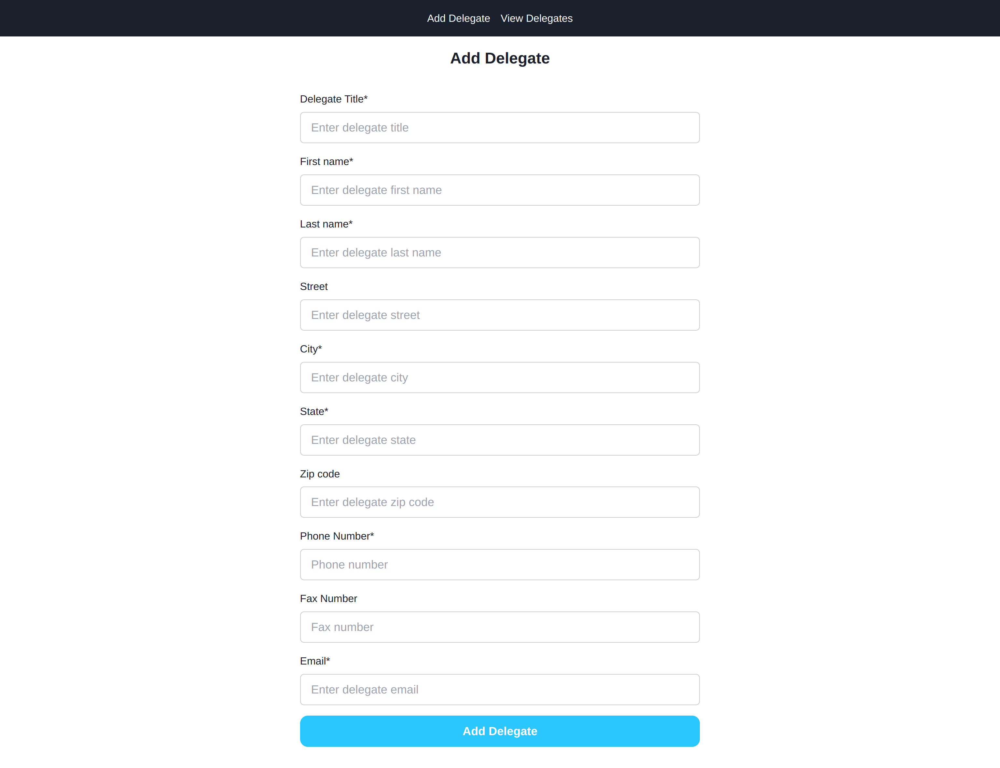
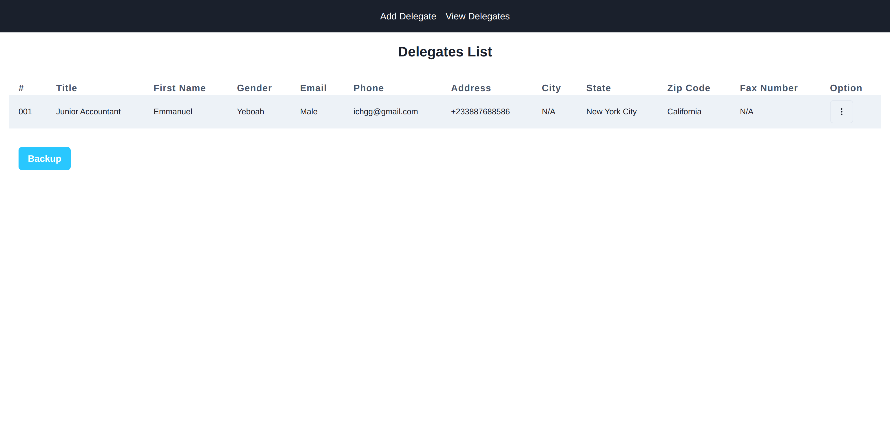
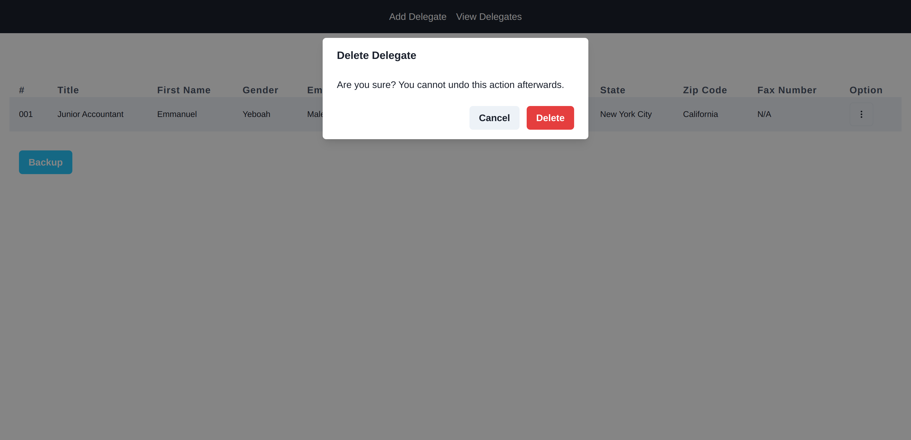
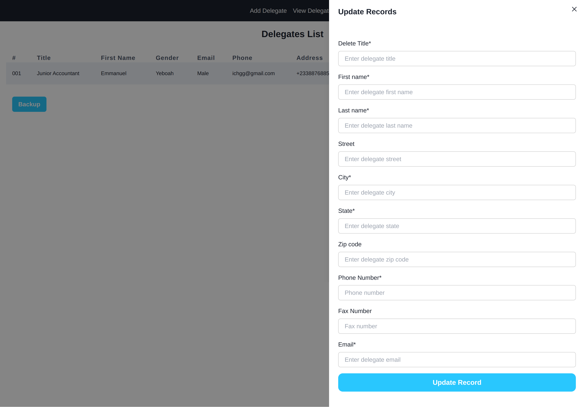

This is a [Next.js](https://nextjs.org/) project bootstrapped with [`create-next-app`](https://github.com/vercel/next.js/tree/canary/packages/create-next-app).

<!-- Image of Forms adding record to database -->

## Image for adding record to the database

<!-- Image for viewing records -->

## Image for viewing delegate records

## Image for deleting a record

## Image for updating a record

